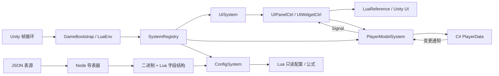

# 架构与扩展约定

## 数据的归属

| 层 | 实现 | 职责 |
| --- | --- | --- |
| 启动与桥接 | C# `GameBootstrap` / `FrameworkServices` | 唯一 LuaEnv、Unity 帧回调、平台资源访问 |
| 常驻业务 | Lua `LuaSystem` 派生类 | 低频业务协调、依赖管理、生命周期 |
| 权威业务数据 | C# `PlayerData` 等 Data 类 | 状态、约束、修改方法、变更通知 |
| UI Model | Lua `PlayerModelSystem` | 转发 C# 数据、命令与通知，不复制权威状态 |
| UI Controller | Lua `UIPanelCtrl` / `UIWidgetCtrl` | 输入、显示逻辑、事件订阅、子控件管理 |
| UI View | C# `LuaReference` + Unity Prefab | 序列化组件绑定，不包含业务状态 |
| 静态配置 | JSON → 二进制 → Lua 只读记录 | 数据驱动的静态规则、数值、公式 |

静态配置与可变业务数据是两种数据。配置按需求在 Lua 使用；金币、角色状态等可变业务数据只有 C# Data 持有。Lua Model 的 `data` 是 C# 对象引用，不是 Lua 拷贝。



## LuaSystem

`Lua/Game/Systems.lua` 是唯一注册入口。`Register(name, type, dependencies)` 只允许启动前调用。稳定拓扑排序使依赖先初始化，所有 `OnInit` 完成后才调用 `OnStart`。循环依赖、缺失依赖、重复注册立即报错。

```lua
local Class = require('Core.Class')
local LuaSystem = require('Core.LuaSystem')
local InventorySystem = Class('InventorySystem', LuaSystem)
function InventorySystem:OnInit(context)
    LuaSystem.OnInit(self, context)
    self.config = context.systems:Get('Config')
end
function InventorySystem:Tick(dt, unscaledDt)
    -- 非性能敏感业务；非必要不进行逐帧轮询。
end
function InventorySystem:OnShutdown()
    -- 释放该 System 注册的外部回调。
end
return InventorySystem
```

`OnInit` 只能访问显式依赖且已初始化的 System；跨多个 System 的启动协作放 `OnStart`。`Tick`、`LateTick` 同时提供 scaled/unscaled 时间，`FixedTick` 提供固定步长，`OnPause` 转发应用暂停。

启动异常按已创建顺序反向释放，包括部分初始化的对象，因此 `OnShutdown` 必须允许未完全初始化。逐帧异常会记录 Lua 堆栈并停用出错的 System（`enabled=false`），避免每帧刷屏；依赖者不会自动重启，项目后续可替换为自己的致命错误界面。正常关闭按依赖反序执行。

## UI 生命周期

配置与生成统一使用 [PanelGenerator](../ForAI/Tools/PanelGenerator.md)。PanelConfig 持有模块、窗口策略和 Prefab 直接引用；Prefab 按模块放在 DynamicAsset，控制器分别平铺于 Lua/UI/Panel 与 Widget。运行时策略和暂停/场景契约见 [UI](../ForAI/Framework/UI.md)。

- Panel 创建：加载 Prefab → `LuaReference.ValidateBindings` → Ctrl 构造 → `Bind` → `Show` / `OnShow`。
- 缓存 Panel 关闭：先隐藏子 Widget、释放 `visibleScope`，再 `OnHide`、隐藏对象；下次 Open 复用实例并刷新参数。
- 不缓存 Panel 关闭：再执行 `Dispose`、释放子 Widget / `lifetime`、`OnDestroy`、销毁 Unity 对象。
- 再次 Open 已打开的 Panel 会刷新 Show 作用域并置顶，不会重复 Bind。
- Widget 是父控制器拥有的逻辑对象，AddWidget 使用已有 LuaReference，CreateWidget 按配置生成独立 Prefab；父 Show/Hide/Dispose 自动递归传递。第一版不提供动态列表池，可在此扩展。
- `Listen(button, fn)` 把 UnityAction 加入 lifetime；显示期间的数据订阅通过 `visibleScope:Add(unsubscribe)` 管理。
- 关闭时即使用户回调异常，Scope 仍尝试执行其余清理。

```lua
function MyPanel:Bind()
    self.model = self.context.systems:Get('PlayerModel')
    self:Listen(self.view.Confirm, function() self.model:GrantReward() end)
end
function MyPanel:OnShow(args)
    self.visibleScope:Add(self.model.Changed:Subscribe(function() self:Refresh() end))
    self:Refresh()
end
```

层级由低到高：Background、Main、Popup、Overlay。同层按打开顺序排列；最上层模态窗口屏蔽下面的窗口输入。Escape 关闭最上方允许返回的窗口；不可返回的模态窗口拦截返回。UI 使用 unscaled 时间的能力交给 Ctrl，不强制在暂停时停止界面。

不要外部直接销毁 UISystem 拥有的 View；通过 `Close(name, forceDestroy)` 释放。如果把异步资源系统接入 `UIHost`，还需为加载取消、过期请求与失败恢复增加协议。

`LuaReference` 在 Inspector 的 Entries 中绑定自定义 Key 与**具体组件**，Lua 使用 `self.view.Key`，原始引用保留在 `self.reference`。例如按钮字段绑定 Button 而非 GameObject；Widget 字段绑定子节点 LuaReference。提供常见 uGUI getter、`GetUITxt` 以及通用 `Get`。UITxt 已基于 TMP 接入；本地化契约见 [专用文档](../ForAI/Framework/Localization.md)。UGUI/TMP 源码嵌入 `Packages`，组件扩展保留在 GameFramework。

## JSON 表源

每张表一个 `Config/Tables/**/<Name>.json`，文件名与 `name` 完全一致，表名全局唯一。目录与模块根节点仅用于组织；共享枚举、模块常量保存于 `Config/Catalog.json`，其稳定 ID 不随目录移动。示例：

```json
{
  "version": 1,
  "name": "Items",
  "description": "物品定义",
  "key": "id",
  "fields": [
    { "name": "id", "type": "int", "min": 1 },
    { "name": "name", "type": "string" },
    { "name": "price", "type": "int", "min": 0, "default": 0 },
    { "name": "power", "type": "formula", "variables": ["level"] }
  ],
  "rows": [
    { "id": 1, "name": "示例物品", "power": "10 + level * 2" }
  ]
}
```

支持 `int`（有符号 int32）、`float`（float64）、`bool`、`string`、`text`、`enum`、`formula`，以及 `int[]/float[]/bool[]/string[]`。text 为本地化标记，当前值仍为默认字符串。主键必须是 int/string，非空且唯一。字段省略时只有存在 `default` 才允许；不做字符串到数字的隐式转换，暂不支持 null/嵌套结构。

字段的 `description` 显示在人类可读的第三行表头。数值可写 `min/max`；共享枚举写 `enumRef: "Demo.Rarity"`，导出解析 Catalog 中显式 int/string 值，旧表内枚举 `values` 仍支持。标量或数组的 int/string 可写 `ref: "TargetTable"`，导出时验证所有引用的主键确实存在且类型匹配。数组数值约束作用于每个元素。

源表最大 100000 行、128 字段、单个数组 65535 项、单个 UTF-8 字符串 1 MiB；网页单次提交上限 2 MiB。较大的源表可直接编辑 JSON 后 CLI 导出。表名区分大小写，但不允许 Windows 下大小写冲突；`Manifest`、`Catalog`、Windows 设备名和原型保留字段名不可使用。

导出先校验全部源表、再编码全部结果；校验失败不会更新已有产物。主键排序保证相同行数据顺序不影响二进制。逐文件通过临时文件替换，未变化的产物不触发重新导入。通过 `Config/export-manifest.json` 清理已删除表的旧生成文件。**这不是跨文件事务**：进程异常中断后重新导出；构建前自动导出，schema 指纹不匹配也会在运行时明确报错。

编辑器使用表源、路径、Catalog 与 Language.lua 的 revision 做乐观并发校验；另一个页面/程序改动源文件后，旧页面保存或导出会收到冲突。没有后台自动保存，未保存修改离开页面会提示。导出会先同步 Language.lua 新键及注释到 LuaTxt；此同步也受全表校验保护。

## 公式

变量必须在字段 `variables` 声明，并在求值时全部提供。支持括号、`+ - * / % ^`、一元正负，以及固定参数个数的 `min(a,b)`、`max(a,b)`、`floor(x)`、`ceil(x)`、`abs(x)`、`clamp(x,min,max)`。指数右结合，优先级高于一元负号：`-2^2 == -4`；模运算遵循 Lua 的向下取整语义。

Node 将表达式编译为后缀指令并写入二进制；Lua 使用固定指令解释器求值，无 `load` / `eval`、文件访问或函数定义。浏览器试算与导表共用解析器；运行时使用 float64 运算，避免 Lua 整数溢出产生不同结果。语法限制 2048 字符 / 256 token；非法变量、函数、参数数量在导出阶段报错，除零、无穷、NaN 在求值阶段报错。

公式没有修改 C# 数据的能力。求值结果写入 C# Data 前，业务还要校验整数性和业务范围（示例奖励已实现）。第一版不含条件表达式、随机数和跨行公式依赖；需要时扩展指令集与格式版本，并增加 Node/Lua 一致性测试。

## 二进制格式 v1

所有数值小端序；字符串为 UTF-8 字节，不带 BOM。

| 内容 | 编码 |
| --- | --- |
| magic | 4 字节 ASCII `YCFG` |
| 格式版本 | uint16 = 1 |
| schema 指纹 | uint32 字节数 + SHA-256 十六进制字符串（64 字节） |
| 行数 | uint32 |
| 每行每字段 | 按生成 schema 的字段顺序 |
| int / float / bool | int32 / float64 / uint8(0 或 1) |
| string / text / string enum | uint32 字节数 + UTF-8 |
| int enum | int32；由 schema.enumType 指定 |
| array | uint32 元素数 + 对应标量元素 |
| formula | uint16 指令数 + 指令序列 |

公式 opcode：1=常量(float64)、2=变量(string)、3–9=加减乘除模幂负号、16–21=min/max/floor/ceil/abs/clamp。其余 opcode 拒绝加载。

运行时校验 magic、版本、schema 指纹、长度、重复主键、公式指令栈、尾部残余字节。指纹检查结构配套性，**不提供数据签名或完整性认证**。这是本地构建产物格式，不是网络协议。

ConfigSystem 按表懒加载，结果缓存到退出；API 为 `Get(id)`（缺失报错）、`Find(id)`（缺失返回 nil）、`All()`、`Count`。表、行、数组和公式使用只读代理，防止普通写操作污染共享配置；这不是对恶意 Lua 脚本的沙箱（`rawset` 等底层能力仍属于受信任游戏代码）。

## Lua 文件加载与构建

业务 Lua 文件只在工程根目录 `Lua/` 维护，使用原生 `.lua` 扩展名，不是 Unity 资源，不需要 `.meta`。导表生成的 `Lua/Generated/*.lua` 使用相同加载流程。

`GameBootstrap` 创建 `LuaFileLoader(LuaScriptPaths.RuntimeRoot)` 并将 `Load` 注册到 `LuaEnv.AddLoader`。模块名 `UI.Panel.DemoCtr` 映射到根目录下的 `UI/Panel/DemoCtr.lua`。加载器用 `File.ReadAllBytes` 读取，清理可选 UTF-8 BOM，并把绝对文件路径返回给 xLua，确保 Lua 堆栈定位到真实源码。仅接受由点分隔的标识符；缺失/无效模块返回 null，让 require 输出加载失败。

编辑器的根目录为 `<工程>/Lua`；桌面 Player 的根目录为 `<Application.streamingAssetsPath>/Lua`。每次创建 LuaEnv 都重新读取源码；同一 LuaEnv 内遵循 require 的 `package.loaded` 缓存，不做自动热重载。

`FrameworkBuildGate.PrepareForBuild` 先导表、检查桥接文件，再由 `LuaBuildFiles.Collect` 校验并收集 `.lua` 文件，通过 [Unity 2022.3 的 AddAdditionalPathToStreamingAssets API](https://docs.unity3d.com/2022.3/Documentation/ScriptReference/Build.BuildPlayerContext.AddAdditionalPathToStreamingAssets.html) 加入成品。没有中间的 Assets 副本；构建只打包 Lua 源码，排除其他扩展名。非法模块路径、大小写冲突、缺失 Main/Generated.Manifest 都阻止构建。

当前使用本地文件路径读取，覆盖已接入的 Windows x64 平台。Android APK/WebGL 的 StreamingAssets 为 URI，需先异步预加载到内存或本地缓存后向同步 require 提供字节，当前加载器会明确拒绝 URI 根目录。

## 工程约定与后续扩展

- C# 与 xLua 使用 Unity 默认程序集，方便小型项目开始；独立 asmdef 可在业务拆分时引入，届时一起调整 xLua 生成位置与程序集引用。
- 单个常驻 GameBootstrap 随场景保留；LuaEnv 每帧 Tick 维护 xLua GC。关闭时先在独立的不内联方法中停止 Lua Systems、释放缓存 LuaFunction/委托和 C# 外部事件，待调用栈返回后再执行 LuaEnv.Dispose 的 GC 与释放流程，防止 Mono 栈上的临时委托保活桥接对象。
- AOT 的桥接文件已生成，但真正的 IL2CPP、其他平台原生插件兼容性需要目标平台构建验证。修改 API/委托后重新生成；构建门禁只检查桥接存在，不自动推断旧桥接是否包含新增签名。
- UI/配置的 Resources 可替换为资源服务，Lua 源码由独立文件加载器负责；C# Data 可追加存档快照/版本迁移；Lua System 可追加场景、任务、音频管理。当前实现没有对游戏类型作假设。
- Config 是只读数据源；运行中编辑 JSON 不会热重载现有缓存。导表后重新进入 Play。开发热重载将需要显式的表版本切换与引用失效策略。
