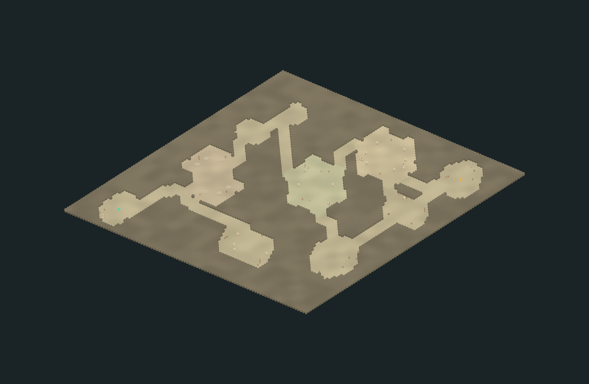

# 地牢第二版：宽空间与三层混合生成

默认仍为 96×96 六边形。一级连接石窟 2 个，二级随机房间 5 个，三级预设房间 3 个；共 10 个房间，主通道净宽至少 5 格。每间房中央保留半径 4 的无障碍战斗空地，当前尚未添加敌人和原地开战流程。

结构参考《破碎地牢》的“先选择房间，再连接和绘制”分工，代码按本项目六边形、配表和状态所有权重新实现。参见[官方 RegularLevel 实现](https://github.com/00-Evan/shattered-pixel-dungeon/blob/master/core/src/main/java/com/shatteredpixel/shatteredpixeldungeon/levels/RegularLevel.java)。

## 测试方式

打开 **Project Y → 地图 → 打开 MapArea 地牢测试**，手动 Play 后进入“古代地下迷宫”。勾选“显示完整结构”，再点“完整布局视角”查看房间等级与整体连接；关闭调试显示则按正常迷雾探索。代码改动后开始新远征，已有远征的静态布局不会中途重新生成。

## 配表入口

所有源表位于 [Config/Tables/MapArea](../Config/Tables/MapArea/)，编辑后运行 `node Tools/ConfigEditor/exporter.mjs`。导出结果仍分别位于加载目录的 `_Gen` 下。

| 调整目的 | 配置 |
| --- | --- |
| 地图宽高、视野、移动间隔 | `MapAreaTable` |
| 各等级房间数量、尺寸、模板清单、通道宽度、战斗空地 | `MapAreaDungeonTable` |
| 二级岩厅、驻扎厅、双腔石窟的边缘和陈设池 | `MapAreaRoomStyleTable` |
| 第三级固定地形格罩、名称和铺地色 | `MapAreaRoomPresetTable` |
| 预设房间里的物件局部坐标、整体旋转 | `MapAreaRoomPlacementTable` |
| 陈设模型 ID、占地和是否挡视线 | `MapAreaPropTable` |
| 入口 Region 的形态、墙高和颜色影响 | `MapAreaThemeTable` |
| 大地图聚落样式与小地图的对应 | `MapAreaEntranceTable` |

实际资源路径使用已有 [MapAssetTable](../Config/Tables/Map/MapAssetTable.json)。模型只负责外观，净宽、占地和视线由配表及算法决定。

## 三个大房间

- **守望者柱厅**：柱列、两端火盆、侧祭台与废拱，中央保持开放。
- **破碎祭庭**：断柱与完整柱混合、侧方祭台、残拱和火盆，铺地略偏苔色。
- **先民墓廊**：成组石棺与杂物分布在外围，中央与出入口预留宽通路。

这些是固定格罩与陈设组合，能整体旋转后参与随机排布；不是再次随机生成后冠以预设名称。连接搜索避让其固有墙体和陈设。

## 实际预览与验证

以下是使用真实大地图入口、导出配置和生产 Lua 生成器，在 Unity Edit Mode 的临时静态预览场景渲染的图片；没有进入 Play，不替代运行时输入验收。

[柱厅近景](../Art/MapLowPoly/Previews/dungeon-preset-1-unity.png) · [祭庭近景](../Art/MapLowPoly/Previews/dungeon-preset-2-unity.png) · [墓廊近景](../Art/MapLowPoly/Previews/dungeon-preset-3-unity.png) · [八件低模陈设](../Art/MapLowPoly/Previews/dungeon-interiors-kit.png)

本次通过 8 项原生 Lua 算法检查与 5 项真实 C# 集成检查，包含连接净宽、战斗空地、固定模板未被挖坏、物件占地、探索路径和重进记录。主动触发一次 Unity C# 编译；未改变 C# Data 桥接 API，因此没有重新生成 xLua 绑定。资源导入与静态预览也已核对。

新增陈设后暴露的大地图资源 ID 20 绑定报错已修正：大地图渲染快照仅输出实际使用的模型；同时同步并保存了 MapRuntimePreview 的 27 项非空资源引用。针对快照资源完整性及排除未用模型的回归通过，无需额外 C# 编译。AdventureDemo 的资源引用也已同步。
