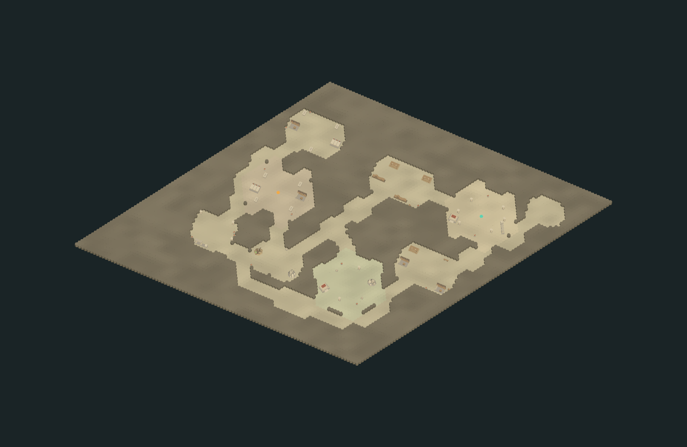
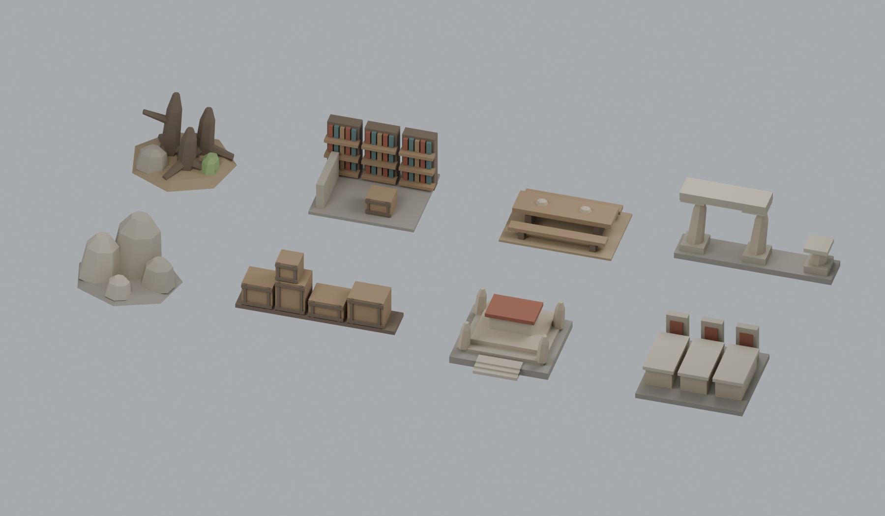

# 地牢第三版：功能分区、多格设施与变宽通道

仍使用 96×96 六边形、10 个房间和三档混合生成。此次重点是空间关系和设施体量，探索/战斗的坐标、状态所有权与操作入口保持原有契约。

## 参考与实际采用的部分

| 资料 | 本版采用的思路 |
| --- | --- |
| Joris Dormans，2010 年论文 [Adventures in Level Design](https://www.pcgworkshop.com/archive/dormans2010adventures.pdf) | 区分地点关系与具体空间；先指定房间用途、分区和入口/目标，再排列房间。 |
| 《Unexplored 2》作者的 [The Theory of the Place](https://www.ludomotion.com/blogs/the-place/) | 用主地点、前厅、环境与侧路建立可读结构；后勤设施围绕前厅，祭祀设施围绕祭庭，墓葬和侵蚀空间组成深处分区。 |
| 《Unexplored 2》作者的 [Level Generation](https://www.ludomotion.com/blogs/level-generation/) | 分阶段细化结构、通路和表现；回路作为明确的连接目标，而非仅加无意义的近邻连线。 |
| 《破碎地牢》作者的 [房间优先生成分享](https://shatteredpixel.com/blog/whats-coming-in-shattered-pixel-dungeon-v060.html) | 房间自己定义内容与可修改范围，连接器保留预设墙体和陈设。 |

这是针对本工程的实现，不是完整移植上述游戏的生成器。当前没有加入钥匙、锁门、任务依赖或敌人部署；房间的“功能”表达为布局、名称和设施组合。

## 本版行为

- **分区组团**：新增前厅后勤、祭祀院落、墓葬洞窟三个分区。主厅先放，附属房间在对应锚点附近寻找合法位置；种子控制整体镜像、交换轴、位置扰动与建筑朝向。人工房间同分区共用建筑轴，石窟可自由转向。
- **有目的的连接**：先连接同分区房间，再连接分区；额外回路优先缩短较长折返，并要求绕过至少三个已有房间连接。固定柱厅作为入口，墓廊作为深处目标。房间位置受边界与占地约束，因此分区是空间偏好，不是硬分割的矩形区域。
- **变宽通道**：最窄 5 格；连续低频噪声产生 5/7/9 格断面，部分中段扩成小厅。两向平滑限制相邻断面半径变化最多 1 格；扩宽不侵入房间或陈设，房门仍保留至少 5 格净宽。
- **成组陈设**：原有小件继续使用，新增八种大型设施。按房间用途选择物件池，先摆大型设施再补小件，以占地覆盖率控制密度。沿墙或随建筑轴排布，天然石堆和根丛可旋转；不侵入保留通道与中央战斗区，不切断可走地面的连通。
- **真实多格占地**：货垛、柱廊各 13 格，石堆、祭台、棺群、根丛、书架和长桌各 19 格。一个设施对应一个完整模型，局部占地坐标随模型一起旋转。大型设施仍是静态陈设，不增加开箱、攀爬或破坏玩法。

## 配表与调节

编辑 [Config/Tables/MapArea](../Config/Tables/MapArea/) 后通过原有导表菜单导出；产物仍进入各加载目录的 `_Gen`。

| 调整项 | 源表与字段 |
| --- | --- |
| 分区位置和名称 | `MapAreaDistrictTable`：`anchorQ/anchorR/name` |
| 使用哪些分区、入口与目标 | `MapAreaDungeonTable`：`districtIds/entryPresetId/goalPresetId` |
| 走廊最小/最大宽度、变化长度、扩厅概率 | `MapAreaDungeonTable`：`corridorRadius/corridorMaxRadius/corridorWidthScale/chamberChance` |
| 回路上限、最小绕行长度 | `MapAreaDungeonTable`：`loopConnections/loopMinHops` |
| 房间用途、形状、物件池和占地覆盖率 | `MapAreaRoomStyleTable`：`districtId/shape/propIds/propCoverage/propCount` |
| 预设房间归属与固定设施位置 | `MapAreaRoomPresetTable.districtId`、`MapAreaRoomPlacementTable` |
| 模型、占地、摆放模式与挡视线 | `MapAreaPropTable`：`assetId/footprintQ/footprintR/placement/blocksSight` |
| 模型路径 | [MapAssetTable](../Config/Tables/Map/MapAssetTable.json)，新增 ID 28–35 |

`footprintQ` 与 `footprintR` 成对列出每个占地格，取代原来的圆形半径字段；必须包含原点且不能重复。随机设施密度受到净空和连通限制，不承诺把目标覆盖率塞满。要增密优先调整设施组合和房间尺寸，不应取消战斗/通道保留区。

## 查看效果

菜单 **Project Y → 地图 → 打开 MapArea 地牢测试**。手动 Play、开始新远征，再进入地牢；勾选“显示完整结构”并选择“完整布局视角”。当前远征内重进同一个地牢会保留既有布局。

下图是实际 Lua 生成结果与导入模型在 Unity Edit Mode 临时场景中的静态渲染，不是 Play 操作录像。

[柱厅近景](../Art/MapLowPoly/Previews/dungeon-v3-preset-1-unity.png) · [祭庭近景](../Art/MapLowPoly/Previews/dungeon-v3-preset-2-unity.png) · [墓廊近景](../Art/MapLowPoly/Previews/dungeon-v3-preset-3-unity.png)

## 本次验证

- 9 项 Lua 检查通过：代表性种子、六种 Region、连通/确定性、探索/视线、预设完整性、战斗空地、变宽断面及旋转占地。固定检查样本出现 17 组大型设施、7 种大型设施样式、2 条额外回路及 5/7/9 格断面。
- 5 项真实 C# 集成检查通过：入口、快照、探索限制、C# 移动状态和重进记录。集成预览样本为 10 房间、56 件陈设；不同入口的数量与摆放会变化。
- 八个新 FBX 的 Unity 尺寸、单位根变换、轴转换和共享材质已核对；水平包围盒采样均落在配置占地内，见[导入记录](../Art/MapLowPoly/Integration/dungeon-groups-unity.json)。AdventureDemo 已保存 35 项资源引用。
- 本轮只改 Lua、配置和资源，未主动触发工程 C# 编译或进入 Play。用户确认结束试玩后完成一次退出，再导入模型；之后用户自行试玩时，仅做只读资源检查。

可编辑来源：[DungeonGroups.blend](../Art/MapLowPoly/Source/DungeonGroups.blend)。
